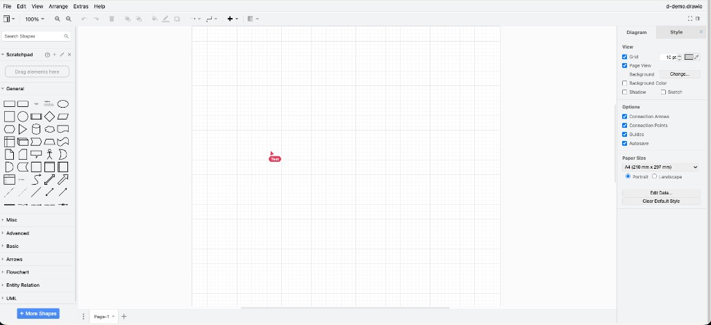

# Draw.io selbst betreiben, mit gemeinsamer Bearbeitung

Diese Anleitung reicht, um den Editor auf einem eigenen Server laufen zu lassen und eine Zeichnung in zwei Browsern gleichzeitig zu bearbeiten. Dieselbe Instanz hängt sich an Nextcloud, weil der Editor das Nextcloud-Plugin `p=nxtcld` benutzt. Die Datei bleibt in Nextcloud oder in deiner eigenen Anwendung. Dieser Server speichert sie nicht.

Englisch, gleicher Ablauf: [README.md](README.md). Warum die Teile so getrennt sind: [docs/why.md](docs/why.md).

## Was du brauchst

- Einen Rechner mit Docker und Docker Compose v2. Das ist der Server, nicht zwingend dein Laptop.
- Einen DNS-Namen, der **direkt** auf diesen Rechner zeigt, zum Beispiel `drawio.example.com`. Kein Proxy davor, der die Zeichnung mitliest oder cacht.
- Die Ports **80** und **443** frei.
- Eine E-Mail-Adresse für das Zertifikat.
- Eine zweite Seite, die den Editor einbettet. Das ist entweder Nextcloud oder das Beispiel auf `http://localhost:3000`.

Wenn Dokploy oder ein anderer Proxy 80 und 443 schon belegt, nimm den Abschnitt [Dokploy](#dokploy). `docker compose up` aus dem Hauptfile und Dokploy gleichzeitig belegen dieselben Ports. Einer von beiden startet dann nicht.

Du brauchst kein draw.io-Repository, keine Datenbank und auf dem Server kein Node. Node auf dem Laptop brauchst du nur für das Beispiel und für `./scripts/test.sh`.

## Lokal in fünf Minuten

Ohne DNS-Namen, ohne Zertifikat, und die Ports 80 und 443 bleiben frei. Du brauchst Docker Compose v2 und Node 20 oder neuer.

```bash
git clone <adresse-deines-repos> draw.io-collaborative
cd draw.io-collaborative
cp .env.example .env
```

Vier Werte in die `.env`. Das Secret darf zum Ausprobieren beliebig sein, nur lang:

```bash
DRAWIO_PUBLIC_HOST=localhost:8080
DRAWIO_ORIGIN=http://localhost:8080
DRAWIO_SCHEME=http
DRAWIO_FRAME_ANCESTORS=http://localhost:3000 http://127.0.0.1:3000
DRAWIO_RT_SECRET=$(openssl rand -hex 32)
```

Editor und Raum starten:

```bash
docker compose -f docker-compose.local.yml up -d --build
```

Die Seite, die den Editor einbettet, im zweiten Terminal:

```bash
cd examples/embed
set -a && source ../../.env && set +a
DRAWIO_EMBED_URL=http://localhost:8080 node server.mjs
```

<http://localhost:3000> in zwei Fenstern öffnen. In jedem ein anderer Vorname, Raum `demo`, **Open editor**.

Ein Rechteck im einen Fenster erscheint im anderen. Ein Klick darauf zeigt dort einen farbigen Rahmen mit dem Vornamen. Die Statuszeile nennt beide Namen.



Die gespeicherte Datei liegt in `examples/embed/data/d-demo.drawio`. Beenden mit `docker compose -f docker-compose.local.yml down`.

`docker compose up` ohne `-f docker-compose.local.yml` ist der Server-Weg weiter unten. Der will die Ports 80 und 443 und einen echten Hostnamen.

## 1. Konfiguration für einen Server

```bash
openssl rand -hex 32
```

Den Hex-String nach `DRAWIO_RT_SECRET=` schreiben. Dann die Hosts. Beispiel mit Nextcloud unter `https://cloud.example.com`:

```bash
DRAWIO_PUBLIC_HOST=drawio.example.com
DRAWIO_ORIGIN=https://drawio.example.com
DRAWIO_SCHEME=https
DRAWIO_FRAME_ANCESTORS=https://cloud.example.com
DRAWIO_RT_SECRET=<derselbe hex-string>
ACME_EMAIL=du@example.com
```

`DRAWIO_PUBLIC_HOST` ist nur der Hostname. Kein `https://`, kein Pfad.

`DRAWIO_SCHEME` bleibt auf dem Server `https`. Nur der Laptop-Weg nutzt `http`.

`DRAWIO_ORIGIN` ist derselbe Editor, mit `https://`. Der Browser öffnet den WebSocket **im iframe**. Die Origin ist deshalb der Editor, nicht Nextcloud. Steht hier die Nextcloud-Adresse, lädt der Editor und der Raum lehnt jede Verbindung ab.

`DRAWIO_FRAME_ANCESTORS` ist, wer den iframe einbetten darf. Die Origin exakt aus der Adresszeile übernehmen, inklusive `https://` und Port. `http://localhost:3000` und `http://127.0.0.1:3000` sind zwei verschiedene Origins. Wer beide aufruft, trägt beide ein.

Dasselbe Secret kommt später in die Anwendung, die den Token ausstellt. Ein leeres Secret lässt niemanden in den Raum. Das ist Absicht.

## 2. Starten

```bash
docker compose up -d --build
```

Der erste Lauf zieht `jgraph/drawio:24.7.17` und holt ein Zertifikat. Wenn der DNS-Eintrag frisch ist, schlägt das Zertifikat einmal fehl und klappt beim nächsten Versuch:

```bash
docker compose logs caddy
docker compose restart caddy
```

Danach:

```bash
./scripts/check.sh
```

Die Ausgabe endet mit `OK`. Vorher prüft das Script vier Dinge:

1. `PreConfig.js` enthält `wss://<dein-host>/rt`, der Platzhalter-Host ist weg, und die Datei nennt weder Pusher noch `app.diagrams.net`.
2. `https://<host>/cache?alive=1` antwortet `1`. Der Editor wartet beim Start auf diese URL. Ein Timeout sieht aus wie ein eingefrorener Editor.
3. `app.min.js` kommt gzip-komprimiert. Unkomprimiert sind es etwa 9 MB.
4. Die HTML-Antwort enthält `frame-ancestors` mit jeder Origin aus der `.env`.

Nach jeder Änderung an `.env`:

```bash
docker compose up -d --force-recreate
./scripts/check.sh
```

Nach einer Änderung an `PreConfig.js` oder `realtime/server.mjs` zusätzlich `--build`.

## 3. Beispielseite gegen den Server

Dieselbe Seite funktioniert auch gegen einen fertigen Host. Secret aus der `.env` des Servers:

```bash
cd examples/embed
DRAWIO_EMBED_URL=https://drawio.example.com \
DRAWIO_RT_SECRET='<dasselbe secret>' \
node server.mjs
```

Dafür müssen `http://localhost:3000` und `http://127.0.0.1:3000` in `DRAWIO_FRAME_ANCESTORS` des Servers stehen.

Die Datei liegt unter `examples/embed/data/d-demo.drawio`. Die laufende Kopie liegt im Arbeitsspeicher des Editor-Hosts und ist 30 Minuten nach dem letzten Schließen weg.

Das Beispiel hat keine Anmeldung und hört nur auf `127.0.0.1`. Port 3000 nicht veröffentlichen.

## Wenn etwas nicht läuft

| Was du siehst | Ursache | Was du änderst |
| --- | --- | --- |
| `Framing … violates … frame-ancestors` | Die Parent-Origin ist nicht erlaubt | Origin exakt in `DRAWIO_FRAME_ANCESTORS`, dann Stack neu erzeugen |
| `PreConfig.js still contains the placeholder host` | `DRAWIO_PUBLIC_HOST` ist noch `drawio.example.com` | Eigenen Hostnamen in die `.env` |
| `ports are not available: … 443` | Ein anderer Proxy hat den Port | Auf dem Laptop `docker-compose.local.yml`, auf dem Server [Dokploy](#dokploy) |
| Editor da, Formen bewegen sich nicht | Socket kommt nicht in den Raum | Netzwerk-Tab: `/rt`. Dann `docker compose logs realtime` |
| Log: `reject /rt origin=-` | Leere Origin, wird geschlossen | Nicht abschalten. Der Browser muss die Editor-Origin schicken |
| Log: `reject /rt origin=https://cloud…` | `DRAWIO_ORIGIN` ist die Parent-Seite | Auf die Editor-Origin setzen |
| Log: `DRAWIO_RT_SECRET is empty` | Secret fehlt oder heißt noch `replace-me` | Dasselbe Secret an beiden Stellen, Container neu erzeugen |
| Editor bleibt grau | `/cache?alive=1` antwortet nicht | `/cache` muss den Raumserver auf dem Editor-Hostnamen erreichen |
| `content-encoding` ist nicht gzip | Alter Tomcat-Prozess | `drawio`-Container neu erzeugen. Nicht mit `curl -I` prüfen, HEAD überspringt die Kompression |

Eine `KeystoreFile`-Warnung aus `/docker-entrypoint.sh` kommt aus dem offiziellen Image und bricht den Start nicht ab.

Das offizielle Image schreibt bei jedem Start eine eigene `PreConfig.js` und gibt sie komplett ins Log aus, inklusive `urlParams['sync'] = 'manual'`. Genau diese Datei überschreibt unser Entrypoint eine Zeile später. Was der Browser bekommt, siehst du so:

```bash
curl -sS http://localhost:8080/js/PreConfig.js | grep -E 'RT_WEBSOCKET_URL|applyPatches'
```

## 4. Nextcloud

Die Nextcloud-App **Draw.io** öffnet den Editor schon mit `p=nxtcld`. Dieses Plugin lädt und speichert die `.drawio`-Datei in Nextcloud. Die App schreibt dazu, dass Zusammenarbeit in Echtzeit nur mit `https://embed.diagrams.net` geht. Der öffentliche Kanal steckt nicht im Docker-Image. Dieser Host ersetzt genau diesen Kanal. Die Datei bleibt in Nextcloud.

1. Draw.io-App installieren und aktivieren.
2. Unter **Administration → Draw.io** die Draw.io-URL auf `https://drawio.example.com` setzen. Kein Pfad, keine Parameter. Autosave an. Speichern.
3. Auf diesem Host `https://<deine-nextcloud-origin>` in `DRAWIO_FRAME_ANCESTORS` eintragen, Stack neu erzeugen, `./scripts/check.sh` muss diese Origin in `frame-ancestors` zeigen.
4. Die kleine Zusatz-App kopieren. Sie signiert den Raum-Token und hängt `room`, `rt`, `who` und `uid` an die iframe-URL. Nextcloud selbst tut das nicht, weil es den öffentlichen Kanal erwartet.

Im Nextcloud-Container (Name aus `docker ps`, Pfad `custom_apps` oder `apps`, je nach Installation):

```bash
docker cp examples/nextcloud/drawio_collab nextcloud:/var/www/html/custom_apps/drawio_collab
docker exec -u www-data nextcloud php occ app:enable drawio_collab
docker exec -u www-data nextcloud php occ config:app:set drawio_collab rt_secret --value='<dasselbe secret>'
```

5. Nextcloud hart neu laden. Dieselbe `.drawio`-Datei mit zwei Konten in zwei Browsern öffnen.

Der Editor kommt von deinem Host, nicht von `embed.diagrams.net`. Eine Form des einen Kontos erscheint beim anderen. In der iframe-URL stehen `p=nxtcld`, `room=d-<datei-id>` und `rt=`.

Fehlt die Zusatz-App oder das Secret, öffnet der Editor trotzdem und Nextcloud speichert weiter. Die Live-Zeiger bleiben aus. Ein kaputter Token soll den Editor nicht abschalten. Die Anfrage, die du suchst, ist `GET /apps/drawio_collab/token?fileId=…`. Status 503: Secret nicht gesetzt. Status 401: niemand ist angemeldet. Öffentliche Freigaben bekommen in dieser App keinen Raum.

Die Nextcloud-App lehnt ein Speichern ab, wenn sich das Etag der Datei geändert hat. Zwei Personen mit Autosave können „Die Datei wurde zwischenzeitlich aktualisiert“ sehen. Die Zeichenfläche ist über diesen Host trotzdem dieselbe. Neu laden, dann stimmt das Etag. Die Draw.io-URL dafür nicht auf `https://embed.diagrams.net` zurückstellen. Damit läuft die Sitzung wieder über den öffentlichen Dienst.

Mehr dazu: [examples/nextcloud/README.md](examples/nextcloud/README.md).

## 5. Eigene Anwendung

Token so bauen wie in `examples/token/` (Node, PHP, Python, ein gemeinsamer Testvektor). Die iframe-URL so bauen wie `iframeUrl` in `examples/embed/server.mjs`. Auf `configure`, `init` und `remoteInvoke` so antworten wie `examples/embed/public/parent.js`.

`getFileInfo` und `saveFile` laufen in der Parent-Seite. Jedes Framework kann diese Parent-Seite sein, der Editor spricht nur `postMessage`. Dieses Repository bringt absichtlich keine Dateiablage mit, also setzt hier nichts eine Datenbank, ein Verzeichnislayout oder ein Benutzermodell voraus. Der Vertrag steht in [docs/contract.md](docs/contract.md).

## Dokploy

Nur wenn Dokploy die Ports 80 und 443 schon hat.

1. Dieses Repository dorthin pushen, wo Dokploy es klonen kann.
2. Compose-Dienst anlegen. Compose-Pfad: `docker-compose.dokploy.yml`. Typ: **Docker Compose**, nicht Stack.
3. Die Schlüssel aus `.env.example` in den Environment-Tab. Dieselben Regeln wie oben. `DRAWIO_RT_SECRET` ist dasselbe wie in der Anwendung, die den Token baut.
4. Autodeploy aus, oder nur dieses Repository beobachten.
5. Deploy. Danach `./scripts/check.sh` von einem Rechner, der den Hostnamen erreicht.

Kein **Raw**-Deploy. Raw löscht das geklonte Verzeichnis und schreibt eine Compose-Datei ohne `PreConfig.js`. Das Image ist dann ein gewöhnliches draw.io, ohne Raum.

Die Traefik-Router heißen `drawio-collab` und `drawio-collab-rt`. Wenn dieser Dokploy-Server die Namen schon hat, in der Compose-Datei umbenennen, bevor du das erste Mal deployest. Ein Konflikt bricht das Deploy ab.

`/rt` und `/cache` haben einen eigenen Router mit höherer Priorität, damit sie den Raumserver treffen und nicht Tomcat. Sie bleiben auf demselben Hostnamen wie der Editor. Ein anderer Hostname wird von der Content-Security-Policy des Editors verworfen.

## PlantUML und Bild-Export

Der Editor läuft ohne beides. Für PlantUML und den Bild-Export im Editor-Menü:

```bash
docker compose -f docker-compose.yml -f docker-compose.export.yml up -d --build
```

Das läuft nur, wenn jemand exportiert. Die `.drawio`-Datei liegt dort nicht.

## Symbolbibliotheken

`libs/` ist leer. Eigene Bibliotheks-XML mounten. Siehe [docs/libraries.md](docs/libraries.md).

## Das lässt du stehen

Jede Zeile ist eine Stelle, an der eine gut gemeinte Änderung die Zusammenarbeit kaputt macht. Die längere Begründung steht in [docs/why.md](docs/why.md).

- Basis-Image `jgraph/drawio:24.7.17` lassen, bis der Zwei-Browser-Test aus [docs/upgrade.md](docs/upgrade.md) auf einem neuen Tag durch ist. `npm test` lädt `app.min.js` nicht. Ein grüner Test sagt nichts über den Shim.
- `sync=manual` nicht entfernen und `/rt` nicht auf diagrams.net zeigen. Deren Kanal antwortet dieser Origin mit 403. Die Patches sind AES-verschlüsselt, der Schlüssel verlässt `app.min.js` nicht.
- `app.min.js` nicht anfassen.
- `entrypoint.sh` lässt das offizielle Entrypoint durchlaufen und überschreibt `PreConfig.js` danach. Das offizielle Entrypoint schreibt die Datei bei jedem Start neu. Wer das umdreht, startet den öffentlichen Kanal oder gar keinen Shim.
- `/rt`, `/cache` und der Editor bleiben auf einem Hostnamen.
- `DRAWIO_ORIGIN` ist der Editor. `DRAWIO_FRAME_ANCESTORS` ist die Parent-Seite. Vertauscht sieht der Deploy gesund aus und der Socket stirbt.
- Leeres `DRAWIO_RT_SECRET` schließt jeden Raum. Die Prüfung nicht abschalten.
- `/cache?alive=1` bleibt offen und antwortet `1`.
- Ein Snapshot ist für jemanden, der später dazukommt. Er wird nicht in eine schon offene Zeichenfläche gezeichnet. Wer das „repariert“, springt die Seite unter der Person, die gerade zeichnet.
- Die Zeichenbytes nicht durch den Websocket der eigenen App schicken. `postMessage` speichert die Datei. Der Raum bewegt die Formen.
- `'unsafe-eval'` in `script-src` nicht streichen. draw.io startet sonst nicht.
- Die Events `drawioPeers` und `drawioRt` nicht umbenennen. Die Parent-Seite und das Beispiel hören auf diese Namen.

## Tests

```bash
./scripts/test.sh
```

Raumserver, Token-Vektor (Node, und PHP sowie Python falls vorhanden) und die Beispiel-API.

## Veröffentlichung

Vorschlag für die GitHub-Beschreibung:

> Self-hosted draw.io with real-time collaborative editing. Live cursors and page sync on your own server. Files stay in your app or Nextcloud. No Cloudflare, no Pusher, no embed.diagrams.net.

Topics: `drawio`, `diagrams-net`, `self-hosted`, `collaboration`, `realtime`, `websocket`, `nextcloud`, `dokploy`.

`realtime/package.json` hat `"private": true`, damit niemand das Paket aus Versehen bei npm veröffentlicht. Veröffentlicht wird dieses Repository.

## Wie das zu den Vorgaben von draw.io passt

- Der Editor ist das offizielle Image `jgraph/drawio` von Docker Hub, gestartet über sein eigenes Entrypoint. Kein Fork, kein Neubau, kein gepatchtes `app.min.js`.
- Konfiguriert wird nur mit dem, was draw.io dafür anbietet: `PreConfig.js` und `PostConfig.js` in der Webapp, die dokumentierten `DRAWIO_*`-Variablen, URL-Parameter und das Embed-Protokoll mit `proto=json`.
- Die Zusammenarbeit benutzt die Seitenfunktionen von draw.io selbst (`diffPages`, `applyPatches`). Das Dateiformat bleibt gleich, eine hier geschriebene Datei öffnet in jedem draw.io.
- Die gehosteten Dienste von diagrams.net bleiben außen vor. `sync=manual` bleibt, der öffentliche Realtime-Kanal wird nicht angerufen, und es wird nicht versucht, ihn zu entschlüsseln oder zu imitieren.
- Das Apache-2.0-Basis-Image behält Lizenz und Hinweise. Die eigenen Dateien sind MIT. Siehe [LICENSE](LICENSE) und [NOTICE](NOTICE).
- draw.io und diagrams.net sind Marken ihrer Inhaber. Dieses Projekt steht nicht mit ihnen in Verbindung und wird von ihnen nicht unterstützt.
- Es werden keine Symbolbibliotheken mitgeliefert. `libs/` ist leer, damit niemand Zeichnungen weitergibt, die ihm nicht gehören.
